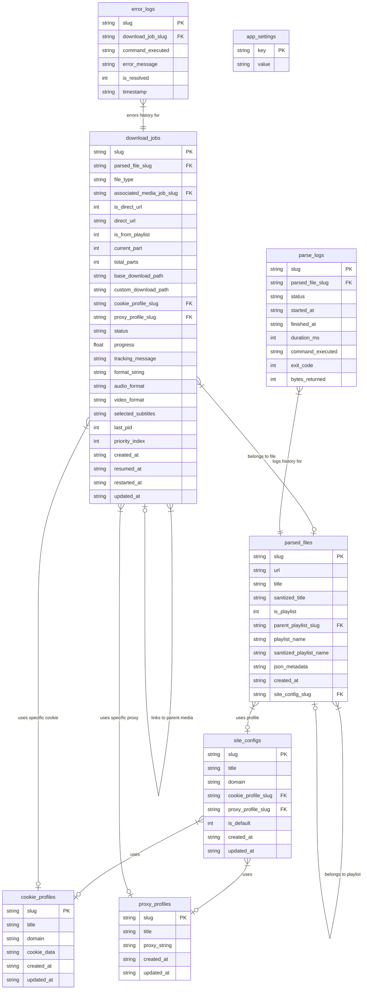

# 🚀 SyncLime: The Best Desktop Downloader

(A simple, fast, and strong app built with Tauri, Rust, and React)

## 📖 What is this? (For Non-Technical HR & Users)
SyncLime is a computer program. It helps you download videos, music, and playlists from the internet. 
Usually, other downloader apps freeze, slow down, or crash when you download too many files at the same time. SyncLime never crashes. It uses a very strong background worker (Rust) to do the heavy lifting. The user screen (React) always stays smooth, fast, and easy to use. 

## 🏆 Why is it so good? (For FAANG Recruiters & Engineers)
- **Very Safe:** It tracks every single task in a strong database (SQLite). If your computer turns off suddenly, you do not lose any data.
- **Super Fast:** It can read big playlists (100+ videos) in just one second.
- **No Freezes:** It updates the download progress bar in smart batches (every 1 second). This means your screen never gets overloaded.
- **Smart Connections:** You can use custom cookies (web keys) and proxies (hidden internet routes) to download safe files block-free.

---

## 🗄️ Database Map
We use SQLite to keep everything safe and linked together. Here is exactly how the tables connect. Every box is a table, and the lists are the fields.



---

## ⚙️ How It Works (Who handles what?)

### 1. The Frontend (React + TypeScript + Zustand)
The frontend draws the buttons, colors, and lists. It **does not** do the actual downloading. It only asks the backend to do things.
*   **Structs / Interfaces:** 
    *   `UIStore`: Keeps track of the dark mode, badges, and which page you are on. (Arguments: `activePath`, `theme`, `downloadPath`).
    *   `ParseState`: Saves video info so the app does not reload the same data twice. (Arguments: `parsedFiles`, `isParsing`).
    *   `QueueState`: Shows the active downloads. Listens to the backend signals to update the UI lines. (Arguments: `queue`, `progressUpdates`).
*   **Functions:**
    *   `handleAction(url)`: Takes your web link, cleans it to make it safe, and asks the backend to check what video it is.
    *   `startDownload(format)`: Takes your quality choice (like 1080p or Audio only) and tells the backend to start a real job.

### 2. The Backend (Rust + Tauri IPC)
The backend does the hard and messy work. It manages folders, big processes, and saves data to SQLite safely.
*   **Structs:**
    *   `AppEngineState`: Holds database connections, safe locks for memory, and the active download processes.
    *   `ResolvedJobConfig`: Computes exactly where a file should go on your PC before saving it.
    *   `DownloadJobRow`: The exact shape of the row going into the database table.
*   **Functions:**
    *   `trigger_job_start(job_slug)`: Looks at the database and starts a new worker thread. It stops you from starting the same job twice.
    *   `request_job_pause(job_slug)`: Kills the active downloader thread instantly and marks it as "paused" in the database safely.
    *   `discover_asset_metadata(target_url)`: Runs a very fast scan to see all video qualities, subtitles, and playlists inside a link.

---

## 🌟 The Best Code Showcase (No Bluff)
When an app downloads 10 files, it prints out a new progress percentage 100 times per second. If we write to a database 100 times per second, the hard drive locks up. If we tell React to redraw the screen 100 times per second, the UI freezes.

Here is the smart code from `src-tauri/src/lib.rs`. It catches all those fast updates into an empty bucket. Then, every `1 second`, it empties the bucket into the database and the UI all at once. **This is why the app never freezes.**

```rust
// A background worker that runs constantly 
tauri::async_runtime::spawn(async move {
    loop {
        // Step 1: Wait exactly 1 second
        tokio::time::sleep(tokio::time::Duration::from_secs(1)).await;
        
        // Step 2: Lock the bucket of new progress updates
        let mut cache = flush_cache.lock();
        if !cache.is_empty() {
            // Step 3: Open the SQLite database
            if let Ok(conn) = rusqlite::Connection::open(&flush_db_path) {
                
                // Step 4: Batch write all updates to the database
                for (slug, snapshot) in cache.iter() {
                    let _ = conn.execute(
                        "UPDATE download_jobs SET progress = ?1, tracking_message = ?2, status = ?3, updated_at = datetime('now') WHERE slug = ?4;",
                        rusqlite::params![snapshot.progress, snapshot.status_message, snapshot.status, slug]
                    );
                    
                    // Step 5: Tell the React Frontend to redraw the bars safely
                    let _ = tic_emitter.emit(
                        "download-progress-token",
                        serde_json::json!({
                            "slug": slug,
                            "progress": snapshot.progress,
                            "message": snapshot.status_message,
                            "status": snapshot.status
                        })
                    );
                }
                // Step 6: Empty the bucket for the next second!
                cache.clear();
            }
        }
    }
});
```
*   **Why is this here?** To stop the database and screen from breaking when downloading fast.
*   **What does it do?** It groups updates into 1-second chunks (we call this "debouncing backpressure").
*   **Who handles it?** The Rust backend handles it perfectly to protect the React frontend.

---

## 🖱️ How to use
1. Paste a video or playlist link into the app.
2. The app analyzes it and asks you what video quality you want.
3. Click "Download".
4. The background Rust engine handles the hard work perfectly while you enjoy your smooth UI!
