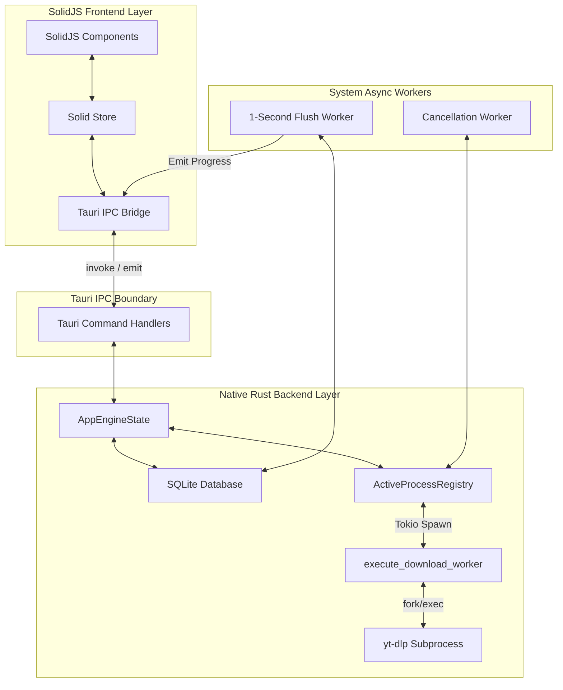
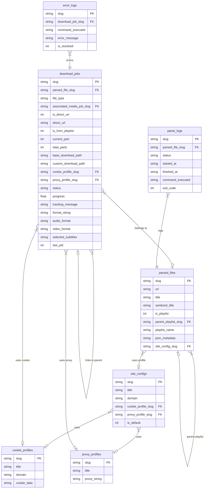

# 🚀 SyncLime (OSGUI)

[](https://tauri.app/)
[](https://www.solidjs.com/)
[](https://www.rust-lang.org/)
[](https://sqlite.org/)
[](https://opensource.org/licenses/MIT)

A premium native desktop media downloader built with Tauri v2, SolidJS, Rust, and SQLite. SyncLime is engineered to manage high-speed multithreaded network queues and large extraction loads smoothly without frontend thread freezes or process ghosting.

---

## 📚 Documentation & Guides
Get up to speed quickly with our dedicated resources:
*   📖 **[System User Guide & Tutorial](tutorial.md)** - Detailed instructions on download strategies, browser extensions, network overrides, and logs diagnostics.
*   🧩 **[Browser Extensions Catalog](extentions.md)** - Companion capture add-ons for Chrome, Firefox, and Brave.

---

## 📌 What is this?
SyncLime is a native desktop application designed for downloading videos, playlists, audio streams, and web documents. 

Many traditional web-style downloaders freeze or lag when dealing with high network loads or capturing massive collections. SyncLime resolves this by offloading parsing operations to a native Rust background task layer and utilizing a lightweight SQLite transactional cache to debouce and serialize UI updates.

### Core Features
*   **Fast Playlist Parsing:** Reads and populates massive playlists (100+ videos) quickly using highly optimized concurrent yt-dlp metadata extraction.
*   **Tactile Desktop Interface:** Redesigned split-pane panels across Home setup, Settings, Extensions marketplace, and Specs dialogs that follow operating system light and dark themes dynamically.
*   **Domain Routing Prefs:** Global and per-domain routing matched rules linking directly to Netscape cookie credentials vaults and custom SOCKS5/HTTP proxies.
*   **Process Protection Limits:** Limits concurrent download worker threads to safeguard local memory, hardware structures, and connection bandwidth.
*   **Quit App Safety confirmation**: Relocates window close buttons to the absolute center of TitleBars, issuing native operating system warnings (`ask()` API) before letting the app close to prevent accidental interruptions.
*   **Diagnostics Logs & Staging**: Monospaced diagnostics streams showing stdout/stderr transactions, featuring one-click clipboard copying triggers and visual copy indicators.
*   **Real-Time Reference Validation**: Real-time validation checks rendering red warning badges on domain rules matching deleted/missing network credentials.
*   **Browser Extensions Sync**: Direct, real-time background syncing of raw links from un-packed browser extensions via local port listener (`127.0.0.1:14221`).

---

## 🏛️ System Architecture

The application uses an event-driven design to connect the SolidJS UI with the Rust backend.



---

## 🗄️ Database Map (SQLite)

We use a relational database to save all downloads safely. Here is how the tables connect:



---

## 🧠 Core Engineering (Who Handles What)

### 1. Stopping Screen Freezes (The Rust Backend)
*   **Problem:** Downloads send progress text thousands of times per second. Saving this to the database instantly freezes the app.
*   **Solution:** We catch the text in memory. A background worker wakes up every 1 second, saves everything to SQLite at once, and sends one small message to the SolidJS UI.
*   **Code in `src-tauri/src/lib.rs` (Rust):**
```rust
// We run this loop in the background forever
tauri::async_runtime::spawn(async move {
    loop {
        // Sleep for exactly 1 second
        tokio::time::sleep(tokio::time::Duration::from_secs(1)).await;
        
        // Grab the bucket of recent progress updates
        let mut cache = flush_cache.lock();
        if !cache.is_empty() {
            if let Ok(conn) = rusqlite::Connection::open(&flush_db_path) {
                for (slug, snapshot) in cache.iter() {
                    // Update SQLite once per second per file
                    let _ = conn.execute(
                        "UPDATE download_jobs SET progress = ?1 WHERE slug = ?2;",
                        rusqlite::params![snapshot.progress, slug]
                    );
                    
                    // Tell the SolidJS frontend to redraw the progress bar
                    let _ = tic_emitter.emit("download-progress-token", serde_json::json!({
                        "slug": slug,
                        "progress": snapshot.progress
                    }));
                }
                cache.clear(); // Empty the bucket for the next second
            }
        }
    }
});
```

### 2. Safe Process Management (The IPC Bridge)
*   **Problem:** If a user clicks "Pause" very fast, it can create ghost processes that never stop.
*   **Solution:** The frontend sends a clean pause signal to Rust, which kills the active download safely.
*   **Code in `src/routes/Downloads.tsx` (SolidJS/Frontend):**
```typescript
// When the user clicks pause in the UI...
const handlePauseToggle = async (job: DownloadJob) => {
    // We instantly update the UI state so it feels snappy
    updateJobStatus(job.slug, "paused");

    // Then we tell the Rust backend to stop the actual OS process
    await invoke("request_job_pause", { jobSlug: job.slug });
};
```
*   **Code in `src-tauri/src/commands/queue.rs` (Rust/Backend):**
```rust
#[tauri::command]
pub async fn request_job_pause(
    job_slug: String,
    state: tauri::State<'_, AppEngineState>,
) -> Result<Response, String> {
    // We safely lock the active processes list
    let mut registry = state.active_processes.write().await;
    
    // If the process is running, we rip it out and kill it instantly
    if let Some(mut child) = registry.remove(&job_slug) {
        let _ = child.kill().await;
    }
    
    Ok(Response { success: true })
}
```

### 3. Database Safety (SQLite)
*   **Problem:** JSON files can corrupt if the app crashes.
*   **Solution:** We use SQLite with foreign keys. If a download uses a custom proxy, it is strongly linked in the database so it never breaks.

---

## ⚡ Installation

### 1. Core Dependencies
To run the core engines, ensure the following utilities are installed on your system:
*   **yt-dlp** (Mandatory - for asset metadata extraction and analysis)
*   **ffmpeg** (Mandatory - for merging formats, muxing streams, and post-processing)
*   **Deno** (Mandatory - for companion browser extension local Axum listeners)
*   **aria2** / **aria2c** (Optional, but **Strongly Recommended** - unlocks extreme high-speed multithreaded network write queues)

> [!TIP]
> **Need help installing these?**
> If you are unsure how to install these dependencies on your specific operating system (Windows, macOS, or Linux distributions), we highly recommend asking AI assistants like **Gemini** or **ChatGPT** for tailored, step-by-step instructions. Just paste this simple prompt:
> *"How do I install yt-dlp, ffmpeg, Deno, and aria2 on [Ubuntu / Debian / Arch / macOS / Windows]?"*

### 2. Check Installed Utilities
```bash
yt-dlp --version
ffmpeg -version
deno --version
aria2c --version
```

### 3. Download App Releases
*   Go to [GitHub Releases](https://github.com/AhmedTrooper/OSGUI/releases).
*   Download the installer for your OS (Windows `.exe`, macOS `.dmg`, or Linux `.deb`).

---

## 🛠️ Local Development

For developers who want to run the code:

### Requirements
*   **Bun:** `v1.x` or later. This is **strictly mandatory** for local development to ensure the `bun.lock` file is maintained perfectly. Do NOT use NodeJS, NPM, or Deno.
*   **Rust:** Stable `cargo` and `rustc`.
*   **C++ Build Tools:** Required for your specific OS (Visual Studio, Xcode, or Ubuntu `build-essential`).

### Setup
1.  **Clone and switch to dev branch:**
    ```bash
    git clone -b dev https://github.com/AhmedTrooper/OSGUI.git
    cd OSGUI
    ```

2.  **Install node modules:**
    ```bash
    bun install
    ```

3.  **Run the app:**
    ```bash
    bun run tauri dev
    ```

---

## 🚀 Build for Production

To create the final installer file:

```bash
bun run tauri build
```
The final files will be saved in: `src-tauri/target/release/bundle/`

---

## 🤝 Contributing

We welcome help from developers! 
1.  Fork the project and branch from `dev`.
    ```bash
    git checkout -b feature/your-feature dev
    ```
2.  Make sure your code is clean (`tsc` and `cargo fmt`).
3.  Open a Pull Request pointing to the `dev` branch.

---

## 📄 License
This project is dual-licensed under the **[MIT License](LICENCE)** and the **[Apache 2.0 License](LICENCE_APACHE%202.0)**.
