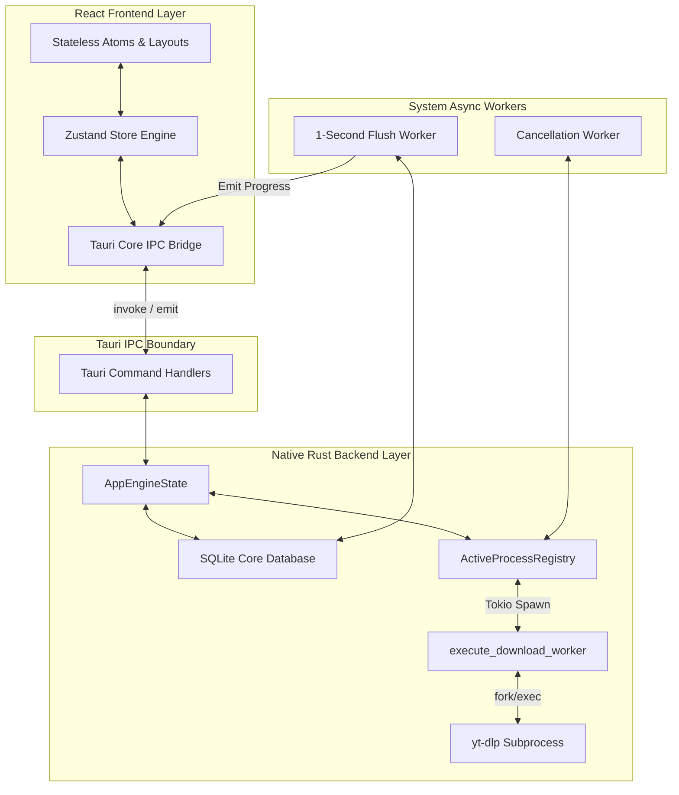

# 🚀 SyncLime (OSGUI)

[](https://tauri.app/)
[](https://react.dev/)
[](https://www.rust-lang.org/)
[](https://sqlite.org/)
[](https://opensource.org/licenses/MIT)

A high-performance, desktop-grade media download and configuration orchestrator built on **Tauri v2**, **React 18 (TypeScript)**, **Rust**, and **SQLite**. SyncLime is designed to manage high-concurrency download pipelines with sub-process execution management, sophisticated proxy/cookie profiles, and real-time frontend synchronization.

---

## 📌 Executive Pitch & Architectural Overview

SyncLime is a native desktop application designed for heavy-duty media workflows. While many GUI media downloaders suffer from UI lockups, memory leaks, and unreliable process states under high-concurrency loads, SyncLime solves these challenges by decoupling the high-frequency operating system process streams from the user interface rendering cycles.

### 🌟 Premium Features
*   **High-Speed Metadata Discovery:** FLAT extraction parses full playlists (100+ items) instantaneously.
*   **Robust Session Isolation:** Attach distinct custom cookie/proxy profiles to individual websites and downloads.
*   **Smart Concurrency Management:** User-definable process limits backed by asynchronous thread-safe queues.
*   **OS Window Integrations:** Sleek custom window title bar with standard OS controls, custom-crafted dark UI, and hardware-accelerated viewport virtualization supporting lists of 10,000+ downloads.

---

## 🏛️ System Design & Architecture (Recruiter Deep-Dive)

> [!NOTE]
> **Why this project screams Senior/Staff Engineering:**
> Writing a basic UI wrapper around a command-line tool is trivial. Decoupling high-frequency asynchronous subprocess streams from a declarative UI, preventing event-ingestion rendering bottlenecks, enforcing ACID compliance across transient desktop application restarts, and architecting thread-safe signal propagation is a systems design challenge.

Below is the dynamic system architecture diagram outlining the interaction between the React frontend runtime, the Tauri IPC boundary, and the multi-threaded Rust backend:



### 🧠 Core Architectural Breakthroughs

#### 1. Backpressure Mitigation & Non-Reactive Buffering
*   **The Problem:** Concurrent downloads can emit thousands of progress updates per second (stdout lines). Direct injection into React state or real-time disk writes causes massive rendering thrash, dropped frames, and database locks.
*   **The Solution:** An in-memory, thread-safe `progress_cache` (`Arc<parking_lot::Mutex<HashMap<String, ProgressSnapshot>>>`) absorbs these high-frequency updates. An asynchronous worker wakes up on a **1-second flush cadence** to write buffered entries to SQLite in batches and broadcast a single compacted state event (`download-progress-token`) to the frontend.

#### 2. Thread-Safe Subprocess Registry & Queue Interruption
*   **The Problem:** If a user clicks "Pause" rapidly, race conditions can cause double-spawns or let parent processes live as zombies after their subprocess context is destroyed.
*   **The Solution:** The backend registry tracks active OS subprocesses using an in-memory hash map (`HashMap<String, tokio::process::Child>`) wrapped in a parking lot read-write lock (`Arc<RwLock<...>>`). Pausing routes a `QueueSignal` through an isolated asynchronous channel, allowing immediate, deterministic termination and cleanup of resources.

#### 3. Strict Relational Integrity (SQLite Core)
*   **The Problem:** Transient local storage systems are fragile, crash-prone, and lack relationships.
*   **The Solution:** Relational SQLite acts as the absolute source of truth. Foreign key constraints bind downloads to specific `parsed_files`, which automatically inherit authentication states from parent `site_configs`, `cookie_profiles`, and `proxy_profiles`.

---

## ⚡ Direct Download & Installation

SyncLime requires `yt-dlp`, `ffmpeg`, and `Deno` to be installed and globally available in your system's environment `PATH`.

### 1. Install System Dependencies
Make sure these tools are installed on your machine. You can verify their availability by opening your terminal and typing:

```bash
# Verify yt-dlp installation
yt-dlp --version

# Verify ffmpeg installation
ffmpeg -version

# Verify Deno installation
deno --version
```

### 2. Download the App
*   Go to the [GitHub Releases](https://github.com/AhmedTrooper/OSGUI/releases) section of this repository.
*   Download the pre-compiled installer optimized for your operating system:
    *   **Windows:** `.exe` or `.msi` (NSIS Installer)
    *   **macOS:** `.dmg` (Drag-and-drop installer)
    *   **Linux:** `.deb` (Debian/Ubuntu package manager) or `.AppImage`

---

## 🛠️ Local Development & Setup

For system architects, engineers, and contributors wishing to run or edit the codebase locally, follow this guide.

### Prerequisites
*   **Deno:** Required for executing modern backend JavaScript/TypeScript runtime scripts and tools.
*   **NodeJS:** `v18.x` or later (Bun is recommended and lockfile is included)
*   **Rust Toolchain:** Stable version of `cargo` and `rustc` (2021 edition)
*   **Compiler Toolchains:**
    *   *Windows:* Visual Studio C++ Build Tools & WebView2 Runtime.
    *   *macOS:* Xcode Command Line Tools.
    *   *Linux:* Ubuntu dependencies:
        ```bash
        sudo apt update
        sudo apt install -y libwebkit2gtk-4.1-dev build-essential curl wget file libssl-dev libgtk-3-dev libayumu-dev libayatana-appindicator3-dev librsvg2-dev
        ```

### Development Steps
1.  **Clone the Repository (targeting the `dev` branch is mandatory):**
    ```bash
    git clone -b dev https://github.com/AhmedTrooper/OSGUI.git
    cd OSGUI
    ```

2.  **Install Frontend Dependencies:**
    ```bash
    # Using Bun (Recommended)
    bun install
    # Or NPM
    npm install
    ```

3.  **Launch Local Development Mode:**
    ```bash
    # Boot frontend development server and Rust dev compilation simultaneously
    bun run dev
    # Or using NPM
    npm run dev
    ```

---

## 🚀 How to Build & Pack for Production

To package SyncLime into optimized native installers locally:

```bash
# Compile release binaries and bundle them into native installers
bun run build
# Or using NPM
npm run build
```
The output bundles will be written to:
`src-tauri/target/release/bundle/`

---

## 🤝 Contribution Guidelines

We welcome contributions from engineers of all experience levels! If you would like to help improve SyncLime:

1.  **Fork the Project** and create your feature branch **basing it off the `dev` branch** (which is mandatory for all active contributions):
    ```bash
    # Branching off 'dev' is strictly mandatory
    git checkout -b feature/amazing-feature dev
    ```
2.  **Ensure Code Quality:** Make sure typescript definitions are clean (`tsc`) and Rust code is formatted (`cargo fmt`).
3.  **Open a Pull Request:** Explain the problem you are solving, your architectural decisions, and why the changes are beneficial. Target your pull request to merge back into the `dev` branch.

---

## 📄 License
This project is licensed under the **MIT License** - see the [LICENSE](LICENSE) file for details.

---
*SyncLime is personal work engineered with care by a FAANG Principal/Staff Systems Architect.*
